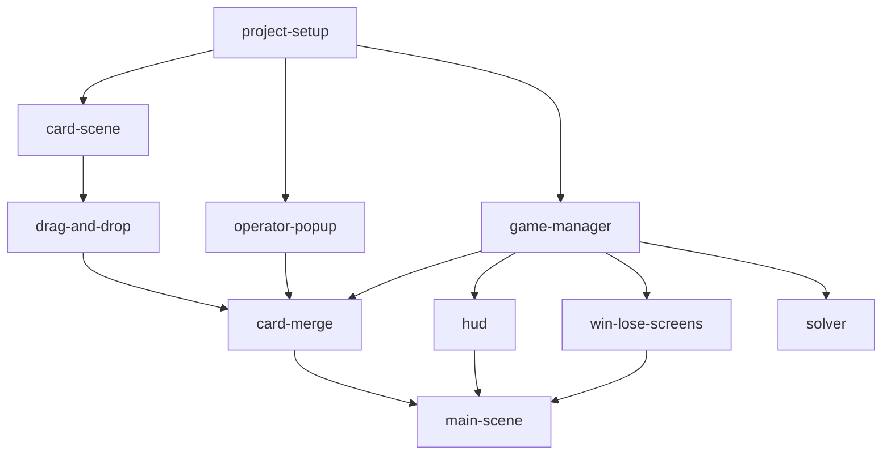

# Card-24 — Tasks

Task index for the Card-24 Godot 4.x puzzle game. See [design.md](design.md) for the full design spec.

> **Progress log:** [progress.md](progress.md) records *how* each task is carried
> out — what was done, decisions made, what works, what doesn't. **Read it before
> starting a task**, and keep your task's section updated as you work, so the next
> task can build on what you learned.

## Design

### Overview
A single-player desktop puzzle game (Godot 4.x / GDScript). The player drags cards
onto each other, selects an arithmetic operator (+, −, ×, ÷), and the two cards
merge into a result card. Win when the final card equals 24.

### Architecture
- `GameManager` autoload — canonical game state (card values, round, score), deal logic, win/lose detection.
- `Card` PackedScene — visual card node (coloured rect + value label) with drag input and Area2D overlap detection.
- `OperatorPopup` — modal overlay showing four operator buttons; fires result back to the merge handler.
- `Main` scene — GameBoard with CardSlots, wires all sub-scenes together, drives the round loop.
- `HUD` — round counter, score, "New Deal" button; reads from GameManager signals.
- `WinScreen` / `LoseScreen` — CanvasLayer overlays triggered by GameManager.
- `Solver` (optional) — brute-force solvability check called at deal time.

### Key choices
- Godot 4.x + GDScript; no third-party addons required.
- Card art: plain coloured rectangles with a value Label; suits are cosmetic only (colour tint).
- Fractions and negative intermediates are allowed (standard 24-game rules).
- Solvability check included but configurable; unsolvable deals are permitted and the player can re-deal at any time.
- Score tracks solved rounds; displayed in HUD.

## Dependencies

Dependency list (a task is executable when all its deps are `[x]` done):

- `project-setup`: (none)
- `card-scene`: `project-setup`
- `game-manager`: `project-setup`
- `operator-popup`: `project-setup`
- `drag-and-drop`: `card-scene`
- `card-merge`: `drag-and-drop`, `operator-popup`, `game-manager`
- `hud`: `game-manager`
- `win-lose-screens`: `game-manager`
- `main-scene`: `card-merge`, `hud`, `win-lose-screens`
- `solver`: `game-manager`

## Tasks

**Legend:** `[ ]` not started · `[~]` in progress · `[x]` done

### Phase 1: Foundation
> Goal: Godot project bootstrapped with core scenes and the game state singleton.

- [ ] [Project setup](tasks/project-setup.md)
- [ ] [Card scene](tasks/card-scene.md)
- [ ] [GameManager autoload](tasks/game-manager.md)
- [ ] [Operator popup](tasks/operator-popup.md)

### Phase 2: Core Gameplay
> Goal: drag-and-drop merge loop works end-to-end in isolation.

- [ ] [Card drag-and-drop](tasks/drag-and-drop.md)
- [ ] [Card merge](tasks/card-merge.md)

### Phase 3: Game Loop & Polish
> Goal: full playable game with HUD, round management, and win/lose screens.

- [ ] [HUD](tasks/hud.md)
- [ ] [Win / Lose screens](tasks/win-lose-screens.md)
- [ ] [Main scene assembly](tasks/main-scene.md)
- [ ] [Solver (optional)](tasks/solver.md)
